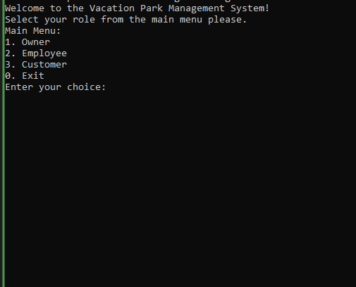

# VacationParcs Management System (C++)

## Table of Contents

- [Overview](#overview)
- [Key Features](#key-features)
- [Getting Started](#getting-started)
- [Usage](#usage)
- [Installation](#installation)
- [Prerequisites](#prerequisites)
- [How to Compile Manually](#how-to-compile-manual)
- [How to Compile using Visual Studio](#how-to-compile-using-visual-studio)
- [License](#license)
- [Diagrams](#diagrams)

## Overview


The VacationParcs Management System is a comprehensive C++ application designed to streamline the management and rental process of accommodations within vacation parks. This system empowers owners, employees, and customers with intuitive tools tailored to their specific needs.

## Key Features

- **Park Management:** Owners can create, modify, and delete vacation parks. Additional services like swimming paradise, bicycle rental, and more can be associated with each park.

- **Accommodation Management:** Owners and employees can efficiently handle accommodations, including creation, modification, and deletion. Each accommodation type (e.g., hotel room, bungalow) comes with specific attributes.

- **Luxury Level Customization:** The luxury level of accommodations can be fine-tuned, allowing for the inclusion of various amenities like BBQ, breakfast service, and more.

- **Customer and Booking Management:** Customers can register, book accommodations, and modify their bookings. Employees handle customer data, bookings, and assist with modifications.

- **Search and Filter Options:** Customers can easily search for accommodations based on their preferences, such as type, capacity, and luxury level.

- **Persistent Data Storage:** All relevant information, including parks, accommodations, customers, and bookings, is saved in files. This ensures data is retained between sessions.

- **Intuitive User Interface:** The system offers a user-friendly interface for seamless navigation and interaction.

- **Flexible Booking System:** Customers can book up to three accommodations in a single park, providing flexibility for different group sizes.

- **Security and Privacy:** Sensitive information like passwords and API keys is handled securely to protect user privacy.

## Getting Started

### Installation

Before running the application, ensure you have the necessary dependencies and follow these installation steps:

### Prerequisites

- C++ Compiler (e.g., g++)
- CMake (for building)
- Git (for version control)

### How to Compile (Manual)

1. Clone this repository to your local machine.

```bash
git clone https://github.com/prgrmcode/VacationParcs_project_OOP.git
```

2. Navigate to the project directory.

```bash
cd VacationParcs
```

3. Create a build directory and move into it.

```bash
mkdir build
cd build
```

4. Generate the build files using CMake.

```bash
cmake ..
```

5. Compile the application.

```bash
make
```

6. Run the program.

```bash
./VacationParcs
```

### How to Compile (Using Visual Studio)

1. Open the VacationParcs project folder in Visual Studio.

2. Configure the project settings for your Visual Studio version.

3. Build the project.

4. Run the program from within Visual Studio.


## Usage


### Detailed Instructions

#### Creating a New Park

1. Click on the "Park Management" menu.
2. Select the "Create Park" option.
3. Fill in the required details such as park name, location, and services.
4. Click "Save" to create the new park.

#### Booking Accommodations

1. Navigate to the "Accommodation Booking" section.
2. Use the search and filter options to find suitable accommodations.
3. Select the desired accommodations and specify booking details.
4. Confirm the booking to reserve the accommodations.

#### Modifying Customer Information

1. Access the "Customer Management" menu.
2. Choose the "Modify Customer" option.
3. Locate the customer you wish to update.
4. Edit the customer's information as needed.
5. Save the changes to update the customer's details.

### Common Usage Scenarios

#### Scenario 1: Planning a Family Vacation

- As a customer, you can easily search for family-friendly accommodations with amenities like children's beds and breakfast services.
- Explore different parks and accommodations to find the perfect spot for a family getaway.

#### Scenario 2: Managing Park Inventory

- Owners and employees can efficiently add new accommodations, update luxury levels, and remove outdated options.
- Keep park offerings up-to-date to attract more customers.

### Tips and Tricks

#### Tip 1: Bulk Booking

- Customers can book multiple accommodations in one go. Simply select all desired accommodations before confirming the booking.

#### Tip 2: Luxury Level Customization

- Owners can fine-tune luxury levels to match seasonal promotions or special offers. Adjust amenities to attract different customer segments.


## License

This project is licensed under the MIT License - see the [LICENSE](LICENSE) file for details.

## Diagrams

- [VacationParcs Class Diagram](./diagrams/VacationParcsClass.png)
- [VacationParcs Use Case Diagram](./diagrams/VacationParcsUseCase.png)
- [VacationParcs Overview](./diagrams/project.PNG)
- [Accommodation Flowchart](./diagrams/project%20workflow.PNG)
- [Customer Booking Process](./diagrams/functions.PNG)


